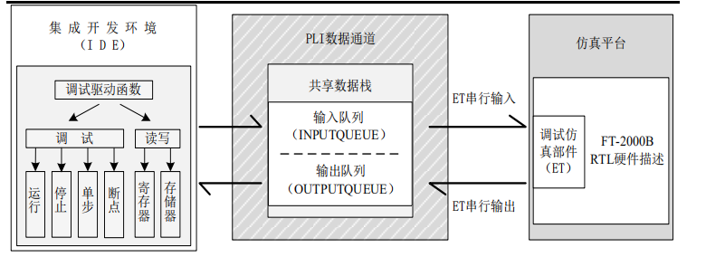

### 专利
使用vpi接口的硬件加速soc芯片
包括:用于与服务器的PCIE扩展槽对应连接的PCIE接口,用于加载运行编入程序的主控CPU,用于控制内存并且实现将内存与主控CPU进行数据交换的DDR3控制器,以及由主控CPU控制且大量分布于片上用于仿真逻辑运算的PE计算阵列，该计算阵列又是由多个PE数据处理单元构成。本实用新型的有益效果是基于PLI或VPI接口,提高仿真效率，减少仿真复杂度，缩短仿真时间。

### 论文
* 1、tag芯片的验证仿真
PLI(RD)模块
PLI(RD)模块主要的任务是把 Reader 发过来的命令转换为Tag可以识别的编码方式，同时需要完成的是C跟Verilog 语言的通信。这部分是用C语言和 PLI共同完成的，生产DLL(动态链接库)文件，在C语言程序可以调用DLL里面生成的函数，而Verilog通过系统函数来调用DLL。
PLI(WR)模块
PLI(WR)模块的作用跟 PLI(WR)模块的作用相似。它的通信方向是由Verilog到C。它的任务是接收Tag 的反应结果，同时处理结果，转换成C程序需要的数据类型。

* 2、改进仿真验证平台：传统FPGA验证方法加入PLI进行数据交换控制
一种新型的基于 PLI 接口技术的仿真调试平台的系统级验证环境

* 3、将pli由于软硬件仿真

pli接口作为中间数据分享站，在FPGA与NC_Sim链接

* 4、在算法仿真工具和HDL仿真工具中建立桥梁
算法仿真工具如：SPW、COSSAP、MATLAB simulink SystemView 
HDL仿真工具如： VerilogXL、VCS、ModulSim
充分在HDL系统仿真是利用好算法仿真过程中的数据，减少运行时间，缩短开发周期。

* 5、基于 C++TCLPLI联合仿真下的芯片验证方法研究
使用脚本语言TCL通过PLI对验证方法的改进

* 6、基于 PLI的 AC97Codec快速仿真模型设计
即使用 VerilogPLI(程序语言接 口)设计 AC97Codec数字接口部分周期精确的仿真模型来加速仿真。加速效果明显，仿真时间减少了约35％。

* 7、对电路节点翻转信息的提取
在基于功能仿真进行集成电路低功耗设计和研究中，往往需要通过获取电路节点的翻转信息来评估设计电路的功 耗并指导相应的优化工作，采用 PLI来扩展仿真工具的功能直接获取设计电路中各个节点的工作状态，实现在仿真过程中节点翻转信息的提取。

* 8、使用pli实现一种故障注入工具
使用pli对于硬件层次数据结构的访问以及修改，对相应的数据位置进行注入错误。

* 9、使用pli注入故障，类似上文，同一实验室论文

* 10、故障注入平台

基于模拟仿真的故障注入技术发生在系统的设计和开发过程阶段，这可以有效缩短验证周期，降低时间代价，其次这种故障注入技术具有良好的观察性和灵活的控制性。

* 11、软硬件联合仿真
利用pli接口对硬件层次的灵活访问实现联合仿真

* 12、协同验证加速

PLI 和 Simics 的微处理器协同验证平台。通常情况下‚Simics 模块和待测模块在同步点 分别向控制模块发送处理器状态‚然后由控制模块 来比较、修改并输出结果，错误点可做特别处理．同 时 Simics 模拟器提供了设置断点的功能，PLI 能与 Verilog 硬件进行交互．利用这些特点‚可以更加丰富验证调试的方法。先在 Simics 中设置断点，Simics 运行到断点自动停止，读取此刻的处理器状态，并通 过 PLI 接口函数将处理器状态复制到待测模型中，这样就加快了验证的速度．也可以将某个寄存器的 信号挂上一个 PLI 中的 c 函数在每个同步点监视该信号这样可以使调试更有方向，增加了验证过程 的可观测性和可控性。

* 13、故障注入
