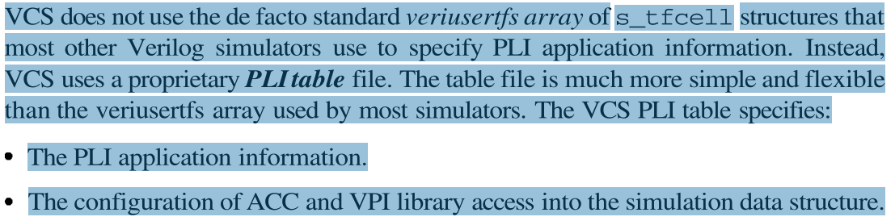

### 迁移cadence，移植到VCS中
cadense仿真器的拓展头文件有：vpi_user_cds.h, vxl_veriuser.h and vxl_acc_user.h。在使用到cadense的专用拓展需要加上这些头文件。

### cadence与VCS的不同
* 头文件有特殊拓展存在不同：vpi_user_cds.h，vcs_acc_user.h

VCS不支持使用将pli应用程序注册在数组中，只能使用tab文件将函数信息定义tab文件中链接。



### vcs编译的步骤

举个例子：
```
//环境变量
TB       = tb1
SEED     = 1
DFILES   = ../mcdt/v1/{arbiter.v,slave_fifo.v,mcdt.v}
VFILES   = $(TB).v
 
VCOMP                = vlogan -full64 -sverilog -timescale=1ps/1ps -nc -l comp.log 
ELAB                 = vcs -full64 -debug_all -l elab.log -sim_res=1ps 
RUN                  = $(TB).simv -l run.log -sml +ntb_random_seed=$(SEED)
 
//Makefile的三段式编译：
comp:
	$(VCOMP) $(DFILES) $(VFILES)  //先compile，DFILES编译的设计文件，VFILES编译的验证文件
  
elab: 
	$(ELAB) -top $(TB) -o $(TB).simv //把编译的设计和验证文件链接到一起，指定最顶层TB，
 
run:
	$(RUN)  //跑仿真，包括log文件，随机种子等
 
rung:
	$(RUN) -gui //跑仿真且调用vcs交互界面
 
clean:
	rm -rf AN.DB DVEfiles csrc *.simv *.simv.daidir ucli.key
	rm -rf *.log* *.vpd 
```

#### error解决
timescale 报错
使用VCS编译时，必须先将含有`timescale或者宏定义的文档放在前面，不然会报错误
